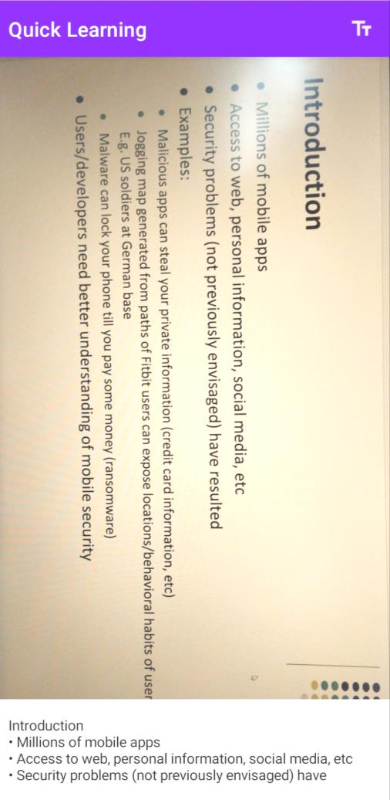

# Quick Learning App

An Android app designed for non-native English speakers, featuring Optical Character Recognition (OCR), Text-to-Speech (TTS), and translation for real-time text recognition and enhanced accessibility.

## Project Files

- video_demo.mp4: A video demo showcasing the app's features.
- quick-learning.zip: The program (source code) for the Quick Learning app.
- PAPER Quick-learning app.pdf: The full project report.

## How to Run the Code

- Unzip the quick-learning.zip file to a location of your choice.
- Open Android Studio.
- Use Android Studio to open the unzipped project folder. All the code will be displayed.
- Run the app on an emulator or a physical device.

## Screenshots

This screenshot shows the Quick Learning App's main screen for capturing images of handwritten text for OCR processing:

This screenshot shows the Optical Character Recognition (OCR) functionality of the Quick Learning App, displaying the recognized text on screen:

## Contributors

- Antonela Tamagnini
- Aikeremu Aixilafu
- Ester Jere
- Adhiraj Budukh
